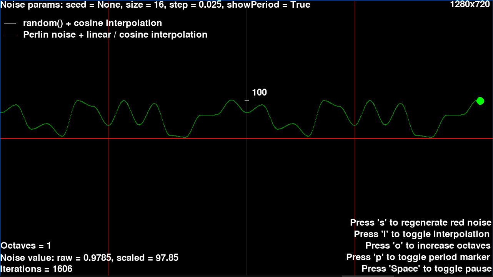

Simple demo of 1D noise.

```
usage: main.py [-h] [--seed SEED] [--mult MULT] [--step STEP] SIZE

positional arguments:
  SIZE         Affects noise period.

optional arguments:
  -h, --help   show this help message and exit
  --seed SEED  E.g. 12345. Default: None.
  --mult MULT  Graph Y multiplier for drawing. Default: 100
  --step STEP  Noise step. Affects drawing smoothness. Default: 0.025
```


